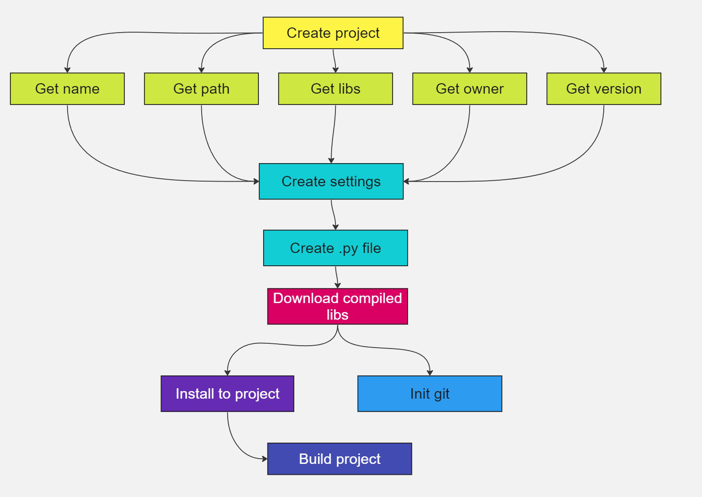
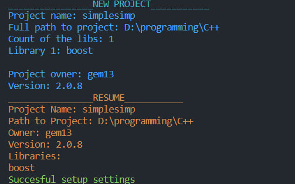

# That is a simple project manager for plug-in libs for C++ project.

## Here is a simple example of using this utility:

> Project name: `my_project`

> Full path to project: `D:\\programming\\CPP\\`

> Count of the libs: `2`

     Library 1: boost
     Library 2: poco
> Project ovner: `gem13`

> Project version: `1.02.24`

